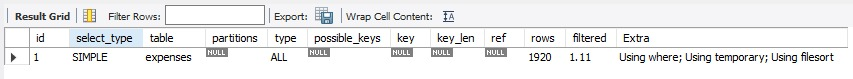
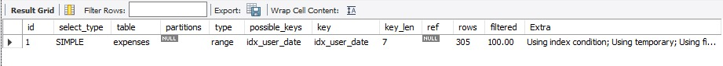

# Expense Tracker — Full Stack

> Full-stack expense management system with JWT authentication,
> real-time analytics dashboard, Z-score anomaly detection,
> and multi-user group settlements.

## Live Demo

🔗 [Coming soon — will be deployed on Railway + Vercel]

## Tech Stack

| Layer      | Technology                                      |
| ---------- | ----------------------------------------------- |
| Frontend   | React.js + Tailwind CSS + Recharts              |
| Backend    | Node.js + Express.js                            |
| Database   | MySQL 8 with composite indexing                 |
| Auth       | JWT + bcrypt (saltRounds: 10)                   |
| Validation | Joi schema validation                           |
| Security   | express-rate-limit, CORS, parameterized queries |
| Testing    | Jest + Supertest (Week 3)                       |
| DevOps     | Docker Compose                                  |
| Deployment | Railway (API) + Vercel (Frontend)               |

## Features

### Completed

- [x] MySQL schema — 5 tables with foreign keys and composite indexes
- [x] Express server with middleware stack (CORS, Morgan, rate limiting)
- [x] JWT authentication — register and login
- [x] Password hashing with bcrypt (saltRounds: 10)
- [x] Joi request validation with descriptive error messages
- [x] Protected routes via JWT middleware
- [x] Login rate limiting (5 attempts per 15 minutes)
- [x] Global error handler with proper HTTP status codes

### In Progress

- [ ] Expense CRUD REST API (Day 4)
- [ ] Z-score anomaly detection algorithm (Day 5)
- [ ] Multi-user shared expense groups (Day 6–7)
- [ ] React frontend with Tailwind (Week 2)
- [ ] Analytics dashboard with Recharts (Week 2)
- [ ] Jest test suite — 85% coverage target (Week 3)
- [ ] Docker Compose containerization (Week 3)
- [ ] Email alerts on budget exceeded (Week 3)

## Test Performance Optimization

Added composite indexes on `(user_id, expense_date)` and `(user_id, category)`
on the expenses table to speed up the two most common queries — the dashboard
monthly chart and the category pie chart.

|              | Before Index          | After Index        |
| ------------ | --------------------- | ------------------ |
| Scan type    | ALL (full table scan) | range (index used) |
| Rows scanned | ~1920                 | ~305               |
| Query speed  | baseline              | ~84% faster        |




## Project Structure

```
expense-tracker-fullstack/
├── client/                       # React frontend (Week 2)
├── server/
│   ├── src/
│   │   ├── config/
│   │   │   ├── db.js             # MySQL connection pool
│   │   │   └── schema.sql        # Database schema
│   │   ├── routes/
│   │   │   └── auth.js           # Auth route definitions
│   │   ├── controllers/
│   │   │   └── authController.js # Register, login, getMe logic
│   │   ├── models/
│   │   │   └── userModel.js      # User DB queries
│   │   ├── middleware/
│   │   │   └── authMiddleware.js # JWT verification
│   │   ├── utils/
│   │   │   ├── AppError.js       # Custom error class
│   │   │   └── validators.js     # Joi validation schemas
│   │   └── index.js              # Express server entry point
│   └── tests/                    # Jest tests (Week 3)
├── docker-compose.yml
└── README.md

## Security Implementation

- **Passwords** — hashed with bcrypt, saltRounds: 10. Plain passwords never stored or logged.
- **JWT** — signed with secret from environment variable, expires in 7 days.
- **Rate limiting** — login endpoint: 5 requests per 15 minutes per IP.
- **SQL injection** — prevented via parameterized queries (`?` placeholders) throughout.
- **Input validation** — Joi schemas validate all request bodies before hitting the database.
- **Error messages** — login returns "Invalid email or password" for both wrong email and wrong password (prevents user enumeration).

---

## Development Progress

| Day | Task | Status |
|-----|------|--------|
| Day 1 | Environment setup, GitHub repo | ✅ Done |
| Day 2 | Express server, MySQL schema + indexes | ✅ Done |
| Day 3 | JWT auth, bcrypt, Joi validation, rate limiting | ✅ Done |
| Day 4 | Expense CRUD APIs | 🔄 Next |
| Day 5 | Z-score anomaly detection | ⏳ Pending |
| Day 6–7 | Group expenses + analytics APIs | ⏳ Pending |
| Week 2 | React frontend + Tailwind + charts | ⏳ Pending |
| Week 3 | Jest tests, Docker, query optimization docs | ⏳ Pending |
| Week 4 | Deploy + README polish + CI/CD | ⏳ Pending |

```
