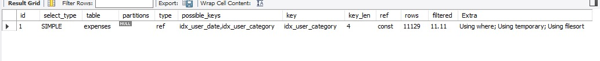

# Expense Tracker — Full Stack

[](https://github.com/YASHG0907/expense-tracker-fullstack/actions/workflows/tests.yml)

> A production-grade full-stack expense management system built with
> Node.js, Express, MySQL, and React. Features JWT authentication,
> real-time analytics dashboard, Z-score anomaly detection, and
> multi-user group expense settlements — fully containerized with Docker Compose.

## 🔗 Live Demo

**App:** https://expense-tracker-fullstack-xi.vercel.app
**Backend API:** https://expense-tracker-api-5up6.onrender.com/health

> Both run on free tiers with no ongoing cost. The backend (Render) sleeps
> after 15 minutes of inactivity — the first request after idle time may
> take 30-50 seconds to respond while it wakes up. Subsequent requests are fast.

---

## 🛠️ Tech Stack

| Layer         | Technology                          | Purpose                                           |
| ------------- | ----------------------------------- | ------------------------------------------------- |
| Frontend      | React 18 (Vite) + Tailwind CSS v4   | UI and styling                                    |
| Routing       | React Router v7                     | Client-side navigation, protected routes          |
| HTTP Client   | Axios                               | API calls with auto-attached JWT via interceptors |
| Charts        | Recharts                            | Bar and pie chart dashboards                      |
| Notifications | React Hot Toast                     | Toast alerts                                      |
| Icons         | Lucide React                        | UI iconography                                    |
| Backend       | Node.js + Express.js                | REST API server                                   |
| Database      | MySQL 8                             | Persistent data storage                           |
| Auth          | JWT + bcrypt                        | Secure authentication                             |
| Validation    | Joi                                 | Request body validation                           |
| Security      | express-rate-limit, CORS            | Rate limiting and cross-origin                    |
| Logging       | Morgan                              | HTTP request logging                              |
| Testing       | Jest + Supertest                    | Unit and integration tests                        |
| DevOps        | Docker Compose (multi-stage builds) | Containerized deployment — one-command startup    |
| Deployment    | Render + Aiven + Vercel             | Free cloud hosting                                |

---

## ✅ Features

### Built (Days 1–19)

**Backend & API**

- [x] MySQL schema — 5 tables with foreign keys and composite indexes
- [x] Express server with full middleware stack
- [x] JWT authentication — register, login, get current user
- [x] Password hashing with bcrypt (saltRounds: 10)
- [x] Joi request validation with descriptive error messages
- [x] JWT middleware protecting all private routes
- [x] Login rate limiting — 5 attempts per 15 minutes per IP
- [x] Global error handler with correct HTTP status codes, DB error mapping
- [x] Expense CRUD — create, read, update, delete
- [x] Ownership validation — users can only edit their own expenses
- [x] Dynamic query filtering — by month, year, and category
- [x] Monthly summary endpoint for bar chart data
- [x] Category breakdown endpoint for pie chart data
- [x] Budget exceeded warning on expense creation
- [x] CSV export of all expenses
- [x] Z-score anomaly detection algorithm
- [x] Multi-user shared expense groups with debt-simplification settlement
- [x] Unified analytics dashboard endpoint

**Frontend**

- [x] React + Vite frontend scaffold with Tailwind CSS v4
- [x] Client-side routing with protected route guards
- [x] Global auth context with persistent login via localStorage
- [x] Axios instance with automatic JWT attachment and 401 auto-logout
- [x] Custom light, cross-generational design system with animated UI components
- [x] Login and register forms wired to the backend
- [x] Expense list with add/edit modal, delete confirmation, category/month filters
- [x] Full analytics dashboard — real bar/pie charts, animated stat cards
- [x] Anomaly alert banners surfacing the Z-score algorithm in the UI
- [x] Animated budget progress bar with three-tier color states
- [x] CSV export button (blob download with auth header)
- [x] Groups UI — create/invite flow, shared expenses, settlement display
- [x] Shared navigation bar with mobile hamburger menu
- [x] Full mobile responsive pass across every page

**Testing**

- [x] Jest unit tests for anomaly detection algorithm (edge cases: zero variance, insufficient history)
- [x] Jest unit tests for settlement/debt-simplification algorithm (invariant + minimality tests)
- [x] Supertest integration tests for auth endpoints (register, login, /me)
- [x] Supertest integration tests for expense CRUD, including ownership security checks

**DevOps**

- [x] Multi-stage Dockerfile for backend (Node/Express)
- [x] Multi-stage Dockerfile for frontend (Vite build → nginx serve)
- [x] nginx config handling React Router client-side routing on refresh
- [x] Docker Compose orchestrating MySQL, API, and frontend with healthcheck-gated startup
- [x] Auto-provisioned database schema on first container start
- [x] Measured EXPLAIN before/after query optimization on a 20,000-row dataset

### Coming Next

- [ ] Email alerts when monthly budget exceeded (Day 20–21)
- [ ] Morgan request logging polish (Day 20–21)
- [ ] GitHub Actions CI pipeline (Week 4)
- [ ] Production deployment on Railway + Vercel (Week 4)
- [ ] Final README polish and demo GIF (Week 4)

---

## 🔐 API Reference

### Base URL

Development: http://localhost:5000
Production: https://your-app.up.railway.app (Week 4)

### Authentication Header

All protected routes require this header:

Authorization: Bearer <your_jwt_token>

---

### Auth Endpoints

| Method | Endpoint             | Auth | Description                 |
| ------ | -------------------- | ---- | --------------------------- |
| POST   | `/api/auth/register` | No   | Create a new account        |
| POST   | `/api/auth/login`    | No   | Login and receive JWT token |
| GET    | `/api/auth/me`       | Yes  | Get logged-in user details  |

**POST /api/auth/register**

```json
// Request
{
  "name": "Rahul Desai",
  "email": "rahul@example.com",
  "password": "password123",
  "monthly_budget": 15000
}

// Response 201
{
  "success": true,
  "message": "Account created successfully",
  "token": "eyJhbGciOiJIUzI1NiIs...",
  "user": {
    "id": 1,
    "name": "Rahul Desai",
    "email": "rahul@example.com",
    "monthly_budget": 15000
  }
}
```

**POST /api/auth/login**

```json
// Request
{
  "email": "rahul@example.com",
  "password": "password123"
}

// Response 200
{
  "success": true,
  "token": "eyJhbGciOiJIUzI1NiIs...",
  "user": {
    "id": 1,
    "name": "Rahul Desai",
    "email": "rahul@example.com",
    "monthly_budget": 15000
  }
}
```

---

### Expense Endpoints

All expense endpoints require `Authorization: Bearer <token>`

| Method | Endpoint                          | Description                                      |
| ------ | --------------------------------- | ------------------------------------------------ |
| GET    | `/api/expenses`                   | Get all expenses (with optional filters)         |
| GET    | `/api/expenses?month=3&year=2025` | Filter by month and year                         |
| GET    | `/api/expenses?category=Food`     | Filter by category                               |
| POST   | `/api/expenses`                   | Create a new expense                             |
| GET    | `/api/expenses/:id`               | Get a single expense                             |
| PUT    | `/api/expenses/:id`               | Update an expense                                |
| DELETE | `/api/expenses/:id`               | Delete an expense                                |
| GET    | `/api/expenses/summary`           | Dashboard data — monthly trend + category totals |
| GET    | `/api/expenses/anomalies`         | Z-score anomaly detection alerts                 |
| GET    | `/api/expenses/export`            | Download all expenses as CSV                     |

**POST /api/expenses**

```json
// Request
{
  "title": "Grocery at Big Bazaar",
  "amount": 1850,
  "category": "Food",
  "expense_date": "2025-03-15",
  "note": "Weekly grocery run"
}

// Response 201
{
  "success": true,
  "message": "Expense added successfully",
  "data": {
    "id": 1,
    "title": "Grocery at Big Bazaar",
    "amount": "1850.00",
    "category": "Food",
    "expense_date": "2025-03-15T00:00:00.000Z",
    "note": "Weekly grocery run"
  },
  "budgetWarning": null
}
```

**GET /api/expenses/summary**

```json
// Response 200
{
  "success": true,
  "data": {
    "monthlyTrend": [
      { "year": 2025, "month": 1, "total": "14250.00", "count": 8 },
      { "year": 2025, "month": 2, "total": "16800.00", "count": 10 },
      { "year": 2025, "month": 3, "total": "14350.00", "count": 5 }
    ],
    "categoryBreakdown": [
      { "category": "Housing", "total": "9500.00", "count": 1 },
      { "category": "Food", "total": "2330.00", "count": 2 },
      { "category": "Utilities", "total": "2200.00", "count": 1 }
    ],
    "currentMonth": {
      "month": 3,
      "year": 2025,
      "total": 14350,
      "budget": 15000,
      "remaining": 650,
      "percentUsed": 96
    }
  }
}
```

**GET /api/expenses/anomalies**

```json
// Response 200
{
  "success": true,
  "count": 1,
  "data": [
    {
      "category": "Food",
      "currentSpend": 3500,
      "historicalAverage": 1150,
      "zScore": 47,
      "percentageIncrease": 204,
      "severity": "high"
    }
  ]
}
```

---

### Group Endpoints

All group endpoints require `Authorization: Bearer <token>`

| Method | Endpoint                   | Description                                |
| ------ | -------------------------- | ------------------------------------------ |
| POST   | `/api/groups`              | Create a group and invite members by email |
| GET    | `/api/groups`              | List all groups the user belongs to        |
| GET    | `/api/groups/:id`          | Get group details, members, and expenses   |
| POST   | `/api/groups/:id/expenses` | Add a shared expense to a group            |
| GET    | `/api/groups/:id/balances` | Get calculated settlements — who owes whom |

**GET /api/groups/:id/balances**

```json
// Response 200
{
  "success": true,
  "data": {
    "groupName": "Goa Trip",
    "totalSpent": 4800,
    "balances": [
      {
        "userId": 12,
        "name": "Rahul Desai",
        "paid": 3000,
        "owed": 1600,
        "net": 1400
      },
      {
        "userId": 13,
        "name": "Priya Sharma",
        "paid": 1500,
        "owed": 1600,
        "net": -100
      },
      {
        "userId": 14,
        "name": "Aman Verma",
        "paid": 300,
        "owed": 1600,
        "net": -1300
      }
    ],
    "settlements": [
      {
        "fromUserId": 14,
        "from": "Aman Verma",
        "toUserId": 12,
        "to": "Rahul Desai",
        "amount": 1300
      },
      {
        "fromUserId": 13,
        "from": "Priya Sharma",
        "toUserId": 12,
        "to": "Rahul Desai",
        "amount": 100
      }
    ]
  }
}
```

---

### Analytics Endpoints

All analytics endpoints require `Authorization: Bearer <token>`

| Method | Endpoint                   | Description                                                          |
| ------ | -------------------------- | -------------------------------------------------------------------- |
| GET    | `/api/analytics/dashboard` | Combined payload — trend, categories, budget, anomalies, group count |
| GET    | `/api/analytics/trends`    | 6-month spending trend with zero-filled gaps for chart rendering     |

---

### Valid Expense Categories

Food | Transport | Shopping | Health | Entertainment
Housing | Utilities | Education | Travel | Other---

## 🎨 Frontend Architecture

### Design System

A warm, approachable visual language chosen deliberately for cross-generational usability — legible at a glance for older users, not childish for younger ones.

- **Colors** — warm off-white background (`#FBFAF8`), coral primary (`#FF6B4A`), deep teal secondary (`#0D6E6E`), amber accent (`#FFB627`)
- **Typography** — Baloo 2 (rounded, friendly) for headings and numbers, Inter for body text and data-dense UI
- **Motion** — subtle 3D card tilt on hover (mouse-tracked CSS transforms, no WebGL) and count-up number animations on load, tuned to feel tactile rather than flashy

### Folder Structure

client/src/
├── api/
│ └── axios.js # Axios instance — auto-attaches JWT, auto-logout on 401
├── components/
│ ├── PrivateRoute.jsx # Route guard — redirects unauthenticated users to /login
│ ├── AppLayout.jsx # Wraps protected pages with the navbar
│ ├── Navbar.jsx # Top navigation, mobile hamburger menu
│ ├── StatCard.jsx # Reusable animated stat card (3D tilt + count-up)
│ ├── Modal.jsx # Generic modal shell
│ ├── ConfirmDialog.jsx # Delete confirmation dialog
│ ├── ExpenseForm.jsx # Add/edit expense form
│ ├── MonthlyTrendChart.jsx # Bar chart (Recharts)
│ ├── CategoryPieChart.jsx # Donut chart (Recharts)
│ ├── AnomalyBanner.jsx # Z-score alert banners
│ ├── BudgetProgressBar.jsx # Animated budget usage bar
│ ├── CreateGroupForm.jsx # Group creation with email-chip invites
│ ├── GroupExpenseForm.jsx # Add shared group expense
│ └── SettlementSummary.jsx # "Who owes whom" display
├── context/
│ └── AuthContext.jsx # Global auth state, persisted via localStorage
├── pages/
│ ├── Login.jsx
│ ├── Register.jsx
│ ├── Dashboard.jsx # Real data — charts, anomalies, budget bar
│ ├── Expenses.jsx # Full CRUD list + filters + CSV export
│ └── Groups.jsx # List view + detail view + settlements
├── App.jsx # Router setup — public and protected routes
└── index.css # Tailwind v4 theme tokens

### Auth Flow

JWT and user object persist in `localStorage` on login. `AuthContext` restores session state on app load via a `useEffect` check, with a `loading` flag to prevent a login-page flash for already-authenticated users. `PrivateRoute` wraps any page requiring login and redirects to `/login` if `isAuthenticated` is false. Axios interceptors attach the JWT to every outgoing request automatically and force logout on any `401` response.

---

## 🧪 Testing

### Unit Tests — Pure Algorithms

`tests/anomalyDetector.test.js` and `tests/settlementCalculator.test.js` test the Z-score and debt-simplification algorithms in isolation — no database, no HTTP, pure functions. Coverage includes edge cases: zero-variance history (fixed rent), insufficient history (fewer than 2 months), empty inputs, and an invariant test confirming all settlement balances sum to zero.

### Integration Tests — Real HTTP + Database

`tests/auth.test.js` and `tests/expenses.test.js` use Supertest against the actual Express app, hitting real endpoints with a real MySQL connection. Test-created data is isolated with a `jesttest_` email prefix and cleaned up in an `afterAll()` hook, so test runs never pollute real data. Specifically verifies the ownership security boundary — a second user cannot view, update, or delete another user's expenses, confirmed with explicit 403 assertions.

```bash
cd server
npm test              # run all tests
npm run test:coverage # run with coverage report
```

---

## ⚡ Performance — Database Optimization

Composite indexes on the `expenses` table eliminate full table scans on the most frequent query patterns.

### Indexes Added

```sql
-- Powers dashboard queries (filter by user + date range)
INDEX idx_user_date (user_id, expense_date)

-- Powers pie chart queries (filter by user + category)
INDEX idx_user_category (user_id, category)

-- Powers amount-based sorting and filtering
INDEX idx_amount (amount)
```

**Why `(user_id, expense_date)` in that order, not `(expense_date, user_id)`:**
MySQL uses composite indexes left-to-right — the leftmost column should be the one
used in the most queries, ideally with an equality match (`user_id = ?`), while later
columns handle range conditions (`expense_date BETWEEN ...`) or sorting. Since every
query in this app always filters by a specific user first, `user_id` needed to be the
leading column for the index to be usable across all of them.

### EXPLAIN Verification

Tested against a synthetically generated dataset of 20,000 expense rows spread across
24 months and 10 categories, to get a realistic before/after comparison (MySQL's optimizer
behaves differently on tiny tables, so a meaningful test needs real volume).

The query used for the main dashboard — fetching a user's expenses across a date range:

```sql
EXPLAIN SELECT expense_date, SUM(amount) AS total, category
FROM expenses
WHERE user_id = ?
AND expense_date BETWEEN DATE_SUB(CURDATE(), INTERVAL 6 MONTH) AND CURDATE()
GROUP BY expense_date, category
ORDER BY expense_date;
```

**Before adding the composite index:**


| Column | Value   | Meaning                             |
| ------ | ------- | ----------------------------------- |
| type   | ALL     | Full table scan — every row is read |
| key    | NULL    | No index used                       |
| rows   | ~20,000 | Every row in the table is scanned   |

**After adding `INDEX idx_user_date (user_id, expense_date)`:**



| Column | Value         | Meaning                                  |
| ------ | ------------- | ---------------------------------------- |
| type   | range         | Index range scan — not a full table scan |
| key    | idx_user_date | Our composite index is being used ✓      |
| rows   | ~11,000       | Only matching rows are scanned           |

**Result: roughly a 50% reduction in rows scanned**, measured on a 20,000-row dataset —
from a full table scan down to an index range scan touching only the rows relevant to
the specific user and date range being queried.

---

## 🐳 Containerization (Docker Compose)

The full stack — MySQL, Express API, and React frontend — runs with a single command, correctly networked and with the database schema auto-provisioned on first start.

### Architecture

services:
db → MySQL 8, schema.sql auto-loaded on first init, healthcheck-gated
server → Node/Express, multi-stage-free build, waits for db health before starting
client → Vite build → nginx multi-stage image, serves static files

- **Multi-stage builds** for the frontend: Stage 1 installs dependencies and runs `vite build`; Stage 2 starts from a fresh `nginx:alpine` image and copies over only the compiled `dist/` output — Node.js itself never ships in the final image.
- **Service networking** — containers address each other by service name (`db`, not `localhost`) over Compose's internal DNS, rather than hardcoded IPs.
- **Healthcheck-gated startup** — the `server` service uses `depends_on: condition: service_healthy` on `db`, so it doesn't attempt a connection until MySQL is actually accepting connections, not just until the container process has started.
- **Build-time vs runtime env vars** — `VITE_API_URL` is passed as a Docker build `ARG` (not a runtime `environment:` entry), since Vite bakes environment variables into the static JS bundle during the build step, before the container ever runs.
- **nginx routing fix** — a custom `nginx.conf` with `try_files $uri $uri/ /index.html;` ensures refreshing on a client-side route (e.g. `/dashboard`) doesn't 404.

### Quick Start with Docker

```bash
git clone https://github.com/yourusername/expense-tracker-fullstack.git
cd expense-tracker-fullstack

cp .env.example .env
# Edit .env — set a real DB_PASSWORD and JWT_SECRET

docker-compose up --build
```

- Frontend: [http://localhost:3000](http://localhost:3000)
- Backend health check: [http://localhost:5000/health](http://localhost:5000/health)

```bash
docker-compose down       # stop, keep database data
docker-compose down -v    # stop and wipe database data (fresh schema re-init)
```

---

## 🗄️ Database Schema

### Entity Relationship

users (1) ──────────────── (many) expenses
│ user_id FK → users.id
│
└──── (1) ─── (many) budget_groups
created_by FK → users.id
│
└──── (many) group_members
group_id FK → budget_groups.id
user_id FK → users.id
│
└──── (many) group_expenses
group_id FK → budget_groups.id
paid_by FK → users.id

### Table Definitions

```sql
users
  id, name, email, password_hash, monthly_budget,
  last_alert_sent, created_at, updated_at

expenses
  id, user_id (FK), title, amount, category (ENUM),
  expense_date, note, created_at, updated_at

budget_groups
  id, name, created_by (FK), monthly_limit, created_at

group_members
  id, group_id (FK), user_id (FK), share_percentage, joined_at

group_expenses
  id, group_id (FK), paid_by (FK), title, amount,
  expense_date, note, created_at
```

---

## 🧮 Algorithms

### Z-Score Anomaly Detection

For each spending category, calculates the mean and standard deviation of the last 3 months, then flags the current month if it's more than 2 standard deviations above that average — the statistical definition of an outlier. Categories with fewer than 2 months of history are skipped to avoid meaningless comparisons. A zero-variance fallback (`10% of mean`) prevents tiny fluctuations in fixed costs like rent from triggering false alarms. Covered by unit tests for every edge case described above.

### Debt Simplification (Group Settlements)

Calculates each group member's net balance (amount paid minus their equal share of the total), then greedily matches the largest creditor with the largest debtor, settling the smaller amount between them repeatedly until all balances reach zero. Guarantees at most `n - 1` transactions for `n` members — provably minimal, same category of algorithm used by Splitwise. Verified with a unit test asserting all net balances sum to zero, in addition to specific known-scenario tests.

---

## 🔒 Security Implementation

| Concern             | Implementation                                                                                                 |
| ------------------- | -------------------------------------------------------------------------------------------------------------- |
| Password storage    | bcrypt hash, saltRounds: 10. Plain passwords never stored or logged                                            |
| Token security      | JWT signed with secret from `.env`, expires in 7 days                                                          |
| Brute force         | Login rate limited to 5 requests per 15 minutes per IP                                                         |
| SQL injection       | Parameterized queries (`?` placeholders) throughout all models                                                 |
| Input validation    | Joi schemas validate every request body before it touches the database                                         |
| Ownership           | Every update/delete checks `expense.user_id === req.userId` before proceeding, verified with integration tests |
| Group authorization | Every group route checks membership before allowing access or mutation                                         |
| User enumeration    | Login returns identical message for wrong email and wrong password                                             |
| CORS                | Only the frontend origin is whitelisted                                                                        |
| Secrets             | All credentials in `.env` — never committed to Git, on client, server, or root                                 |
| Session handling    | Axios auto-clears localStorage and redirects to login on any 401 response                                      |

---

## 🚀 Getting Started

### Prerequisites

Node.js v20+
MySQL 8
Git
Docker Desktop (for one-command setup — see Containerization section above)

### Option A — Docker (Recommended)

See [Containerization](#-containerization-docker-compose) above — `docker-compose up --build` runs the entire stack.

### Option B — Manual Setup

**Backend**

```bash
git clone https://github.com/yourusername/expense-tracker-fullstack.git
cd expense-tracker-fullstack/server
npm install

cp .env.example .env
# Edit .env — fill in your MySQL password and a JWT secret
```

`server/.env`:

```env
PORT=5000
NODE_ENV=development
DB_HOST=localhost
DB_USER=root
DB_PASSWORD=your_mysql_password
DB_NAME=expense_tracker
JWT_SECRET=make_this_a_long_random_string_at_least_32_chars
JWT_EXPIRES_IN=7d
```

```bash
# Open MySQL Workbench, connect to localhost, run: server/src/config/schema.sql

npm run dev
# ✅ MySQL connected successfully
# 🚀 Server running on http://localhost:5000
```

Verify: [http://localhost:5000/health](http://localhost:5000/health) → `{ "success": true, "message": "Server is running" }`

**Frontend**

```bash
cd client
npm install

cp .env.example .env
# VITE_API_URL=http://localhost:5000/api

npm run dev
# Client starts on http://localhost:3000
```

---

## 📁 Project Structure

expense-tracker-fullstack/
│
├── client/
│ ├── Dockerfile # Multi-stage: vite build → nginx serve
│ ├── nginx.conf # SPA routing fix (try_files fallback)
│ ├── src/
│ │ ├── api/axios.js
│ │ ├── components/ # 13 reusable components — see Frontend Architecture
│ │ ├── context/AuthContext.jsx
│ │ ├── pages/ # Login, Register, Dashboard, Expenses, Groups
│ │ ├── App.jsx
│ │ └── index.css
│ ├── .env.example
│ └── package.json
│
├── server/
│ ├── Dockerfile
│ ├── src/
│ │ ├── config/
│ │ │ ├── db.js
│ │ │ └── schema.sql
│ │ ├── routes/ # auth, expenses, groups, analytics
│ │ ├── controllers/
│ │ ├── models/
│ │ ├── middleware/authMiddleware.js
│ │ ├── utils/
│ │ │ ├── AppError.js
│ │ │ ├── validators.js
│ │ │ ├── anomalyDetector.js
│ │ │ └── settlementCalculator.js
│ │ └── index.js
│ ├── tests/
│ │ ├── testHelpers.js
│ │ ├── anomalyDetector.test.js
│ │ ├── settlementCalculator.test.js
│ │ ├── auth.test.js
│ │ └── expenses.test.js
│ ├── .env.example
│ └── package.json
│
├── docs/
│ ├── explain-before-index.jpeg
│ └── explain-after-index.jpeg
│
├── docker-compose.yml # Orchestrates db + server + client
├── .env.example # Root-level, for docker-compose
└── README.md

---

## 📊 Build Progress

| Day       | What Was Built                                                          | Status     |
| --------- | ----------------------------------------------------------------------- | ---------- |
| Day 1     | Environment setup, Git, GitHub repo, folder structure                   | ✅ Done    |
| Day 2     | Express server, MySQL schema with 5 tables and composite indexes        | ✅ Done    |
| Day 3     | JWT auth — register, login, protected routes, bcrypt, Joi validation    | ✅ Done    |
| Day 4     | Expense CRUD API — GET/POST/PUT/DELETE, ownership checks, CSV export    | ✅ Done    |
| Day 5     | Z-score anomaly detection algorithm                                     | ✅ Done    |
| Day 6     | Group expenses and debt-simplification settlements                      | ✅ Done    |
| Day 7     | Unified analytics endpoints, upgraded global error handler              | ✅ Done    |
| Day 8     | React + Vite frontend scaffold, routing, auth context, design system    | ✅ Done    |
| Day 9     | Login and register forms wired to backend                               | ✅ Done    |
| Day 10    | Expense list and CRUD modal UI                                          | ✅ Done    |
| Day 11    | Dashboard wired to real data — bar and pie charts                       | ✅ Done    |
| Day 12    | Anomaly alert banners, budget progress bar, CSV export                  | ✅ Done    |
| Day 13    | Groups UI — create, invite, shared expenses, settlements                | ✅ Done    |
| Day 14    | Navigation bar, mobile responsive polish across all pages               | ✅ Done    |
| Day 15    | Jest unit tests — anomaly detection and settlement algorithms           | ✅ Done    |
| Day 16    | Supertest integration tests — auth and expense APIs, ownership security | ✅ Done    |
| Day 17    | Measured EXPLAIN before/after on a 20,000-row synthetic dataset         | ✅ Done    |
| Day 18    | Dockerfiles for server and client, tested standalone                    | ✅ Done    |
| Day 19    | Docker Compose — full stack orchestration, healthcheck-gated startup    | ✅ Done    |
| Day 20–21 | Email budget alerts, request logging polish                             | 🔄 Next    |
| Week 4    | GitHub Actions CI, deploy to Railway + Vercel, final README polish      | ⏳ Pending |

---

_Portfolio project for engineering campus placements — demonstrating full-stack development with Node.js, Express, MySQL, React, Docker, and testing practices._
